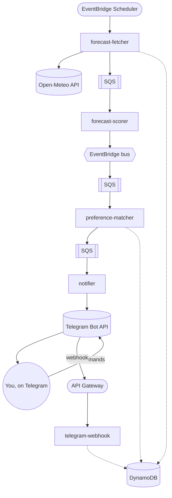

# kite-signal

Monitors a curated list of kitesurf spots for good wind conditions and notifies subscribers
via Telegram — e.g. *"Nin, Croatia: excellent kite conditions Saturday afternoon."*

It's also a personal vehicle for a from-scratch, production-shaped serverless build on AWS:
event-driven pipeline, Terraform IaC, structured logging/metrics/tracing, CI/CD via GitHub
OIDC — kept cheap (pay-per-use, near-zero idle cost) since it's a solo/personal project.

## Status

Stage 1 (forecast monitoring + spot scoring) and Stage 2 (Telegram subscriptions +
notifications) are fully built. See [`docs/architecture-plan.md`](docs/architecture-plan.md)
for the full design, decisions, and roadmap (Stage 3: trip budget estimation, Stage 4: mobile
app — not started).

## Architecture



Users manage subscriptions via Telegram bot commands (`/subscribe`, `/mysubs`, etc. — see
[`services/telegram-webhook`](services/telegram-webhook)). Spots are curated as
source-controlled JSON in [`spot-data/`](spot-data) — see
[`spot-data/README.md`](spot-data/README.md) for the schema and why it's deliberately not an
admin UI.

## Repo layout

- `packages/` — shared TypeScript: `domain` (pure scoring logic), `db` (DynamoDB
  repositories), `forecast-clients` (weather provider adapters), `notification-channels`
  (Telegram today, extensible), `events` (cross-service event schemas), `observability`
  (logging/metrics/tracing factories)
- `services/` — one Lambda per deployable unit (see the pipeline above, plus `hello`, a
  minimal example proving the Terraform/IAM/logging pattern)
- `infra/` — Terraform: `bootstrap` (one-time state backend), `modules` (reusable building
  blocks), `envs/prod` (the actual deployed stack)
- `spot-data/` — curated spot knowledge base + seed script
- `docs/` — [`architecture-plan.md`](docs/architecture-plan.md) (design/decisions) and
  [`manual-setup.md`](docs/manual-setup.md) (account setup, deployment, one-off manual steps)

## Getting started

New to this repo? Start with [`docs/manual-setup.md`](docs/manual-setup.md) — it walks
through AWS account setup, deploying the stack, creating the Telegram bot, and wiring up
GitHub Actions, in the order you actually need them.

```sh
npm install
npm run typecheck
npm run lint
npm test
npm run build:services   # esbuild-bundles every Lambda before a terraform apply
```

## Tech stack

TypeScript (Node 24 dev tooling) · AWS Lambda, DynamoDB, SQS, EventBridge, API Gateway ·
Terraform · GitHub Actions (OIDC, no long-lived AWS keys) · AWS Lambda Powertools · vitest
